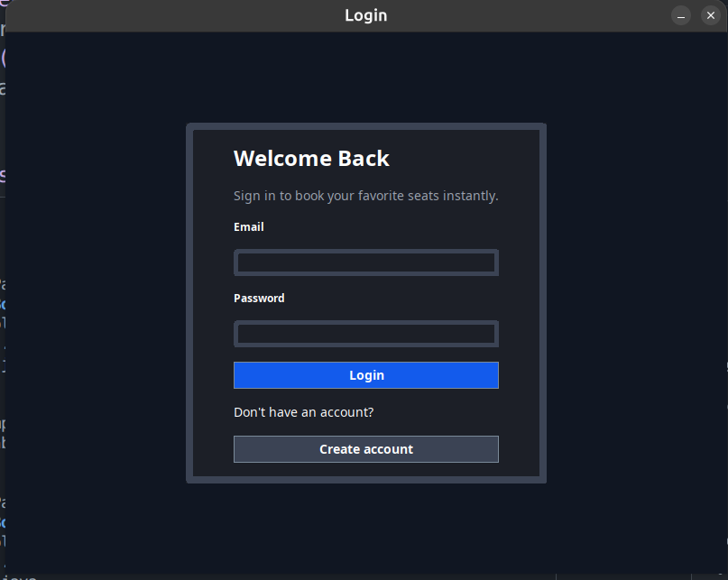
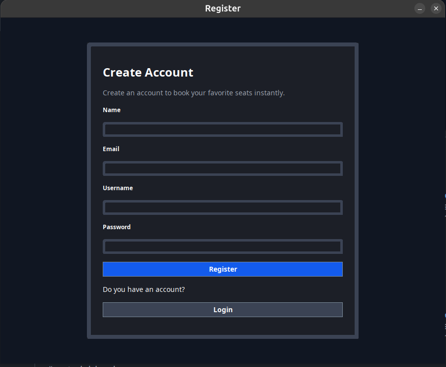
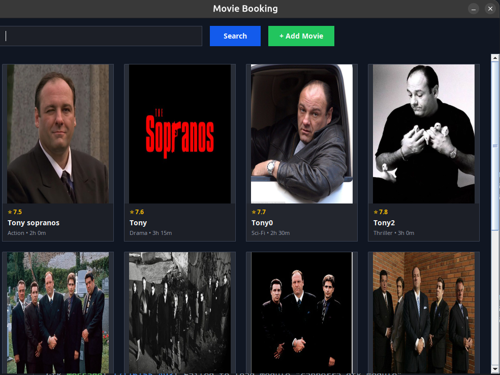
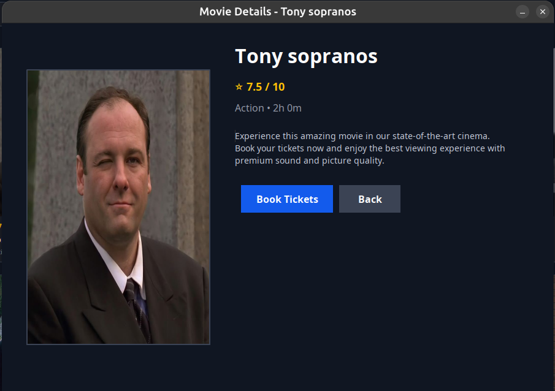
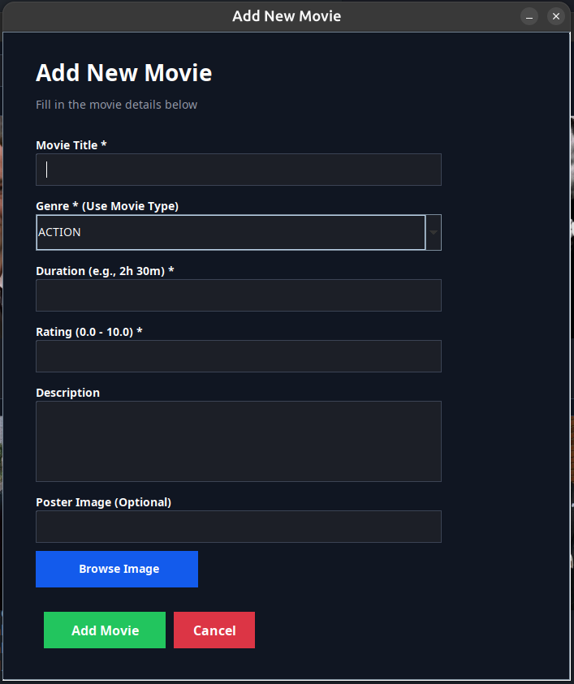

# 🎬 Movie Ticket Booking System

<div align="center">

A comprehensive desktop application for managing movie ticket bookings, built with Java Swing and implementing 7 design patterns for clean, maintainable, and scalable code.

[](https://www.oracle.com/java/)
[](https://www.sqlite.org/)
[](LICENSE)

</div>

---

## 📋 Table of Contents

- [Description](#-description)
- [Features](#-features)
- [Screenshots](#-screenshots)
- [Tech Stack](#-tech-stack)
- [Design Patterns](#-design-patterns)
- [Installation](#-installation)
- [Usage](#-usage)
- [Configuration](#-configuration)
- [Folder Structure](#-folder-structure)
- [Project Architecture](#-project-architecture)

---

## 🎯 Description

The **Movie Ticket Booking System** is a full-featured desktop application that allows users to browse movies, select seats, and book tickets with various payment options. The system includes admin functionality for movie management and implements multiple design patterns to ensure code quality, maintainability, and extensibility.

### Key Highlights

- ✨ **User-friendly GUI** built with Java Swing
- 🔐 **Secure authentication** system with user registration and login
- 🎭 **Movie management** with support for multiple genres and ratings
- 💺 **Interactive seat selection** with real-time availability
- 💳 **Multiple payment methods** (Credit Card, PayPal, Bank Transfer)
- 🎫 **Ticket customization** with various add-ons and extras
- 📊 **SQLite database** for persistent data storage
- 🏗️ **7 Design Patterns** for clean architecture

---

## ✨ Features

### User Features

- **🔑 Authentication**
  - User registration with email and username validation
  - Secure login system
  - Session management

- **🎬 Movie Browsing**
  - View all available movies
  - Search movies by title
  - View detailed movie information (genre, duration, rating, description)
  - Movie poster display

- **💺 Seat Selection**
  - Interactive seat map visualization
  - Real-time seat availability checking
  - Multiple seat selection
  - Visual indicators for occupied/available seats

- **🎫 Ticket Booking**
  - Create bookings with selected seats
  - Automatic price calculation
  - Support for discounts (student, senior, group)
  - Ticket extras and add-ons:
    - 🍿 Popcorn & Drink
    - 🕶️ 3D Glasses
    - 💺 Premium Seat Upgrade
    - 🏆 VIP Lounge Access
    - 🚗 Reserved Parking
    - 🍽️ Meal Vouchers
    - 🛡️ Ticket Insurance

- **💳 Payment Processing**
  - Multiple payment methods:
    - Credit Card
    - PayPal
    - Bank Transfer
  - Transaction ID generation
  - Payment confirmation

### Admin Features

- **🎭 Movie Management**
  - Add new movies with full details
  - Clone existing movies (for sequels)
  - Movie genre factory with default descriptions
  - Age restriction enforcement

- **📊 Booking Management**
  - View all bookings
  - Track booking history
  - Monitor seat occupancy

---

## 📸 Screenshots

### Authentication Screens

<div align="center">

#### Login Screen


#### Registration Screen


</div>

### Main Application Screens

<div align="center">

#### Home Screen


#### Movie Details Screen


#### Book Ticket Screen


</div>

### Admin Screens

<div align="center">

#### Add Movie Screen


</div>

---

## 🛠️ Tech Stack

### Core Technologies

- **Java** - Primary programming language
- **Java Swing** - GUI framework
- **SQLite** - Relational database
- **JDBC** - Database connectivity

### Dependencies

- `sqlite-jdbc.jar` - SQLite JDBC driver
- `slf4j-api.jar` - Simple Logging Facade for Java
- `slf4j-simple.jar` - SLF4J Simple implementation

### Development Tools

- Java Compiler (javac)
- Java Runtime Environment (JRE)

---

## 🏗️ Design Patterns

This project implements **7 design patterns** to demonstrate best practices in software architecture:

### 1. **Singleton Pattern** 🔒
- **Purpose**: Ensure single instance of critical components
- **Implementation**:
  - `BookingSystem` - Central booking management
  - `DatabaseManager` - Single database connection
  - `SessionManager` - User session management
- **Benefits**: Resource efficiency, state consistency

### 2. **Factory Pattern** 🏭
- **Purpose**: Centralized object creation
- **Implementation**:
  - `MovieFactory` - Create movies by genre with default configurations
  - `TheaterFactory` - Create different theater types (Standard, IMAX, VIP, Dolby Atmos, 4DX)
- **Benefits**: Encapsulation, maintainability, extensibility

### 3. **Builder Pattern** 🔨
- **Purpose**: Construct complex objects step-by-step
- **Implementation**:
  - `MovieBuilder` - Build movies with optional parameters
  - `BookingBuilder` - Build bookings with complex pricing logic
- **Benefits**: Readability, flexibility, validation

### 4. **Prototype Pattern** 📋
- **Purpose**: Clone existing objects efficiently
- **Implementation**:
  - `MoviePrototype` - Clone movies for sequels/prequels
- **Benefits**: Time-saving, consistency, deep copying

### 5. **Adapter Pattern** 🔌
- **Purpose**: Integrate incompatible payment systems
- **Implementation**:
  - `PaymentProcessor` - Unified interface (Target)
  - `PaymentAdapter` - Adapters for payment systems
  - `CreditCardAdapter`, `PayPalAdapter`, `BankTransferAdapter`
  - `PaymentAdapterFactory` - Factory to create appropriate adapter
- **Benefits**: Flexibility, extensibility, separation of concerns, unified interface

### 6. **Proxy Pattern** 🛡️
- **Purpose**: Control access and add functionality
- **Implementation**:
  - `MovieProxy` - Age restriction enforcement
  - `AdminMovieProxy` - Admin-only operations
- **Benefits**: Access control, lazy loading, security

### 7. **Decorator Pattern** 🎨
- **Purpose**: Dynamically add features to tickets
- **Implementation**:
  - `TicketDecorator` - Base decorator
  - Multiple decorators: `PopcornDrinkDecorator`, `ThreeDGlassesDecorator`, `PremiumSeatDecorator`, etc.
- **Benefits**: Flexibility, open-closed principle, composition over inheritance

---

## 📦 Installation

### Prerequisites

- **Java Development Kit (JDBC)** version 8 or higher
- **Git** (optional, for cloning the repository)

### Step-by-Step Installation

1. **Clone or download the repository**
   ```bash
   git clone <repository-url>
   cd movieTicketBookingSystem
   ```

2. **Verify Java installation**
   ```bash
   java -version
   javac -version
   ```

3. **Ensure dependencies are present**
   - The following JAR files should be in the project root:
     - `sqlite-jdbc.jar`
     - `slf4j-api.jar`
     - `slf4j-simple.jar`

4. **Compile the project** (optional - run scripts handle this automatically)
   ```bash
   # Linux/Mac
   javac -cp ".:sqlite-jdbc.jar:slf4j-api.jar:slf4j-simple.jar" -d bin -sourcepath src src/database/*.java src/model/*.java src/core/*.java src/gui/*.java src/adapter/*.java src/builder/*.java src/decorator/*.java src/factory/*.java src/prototype/*.java src/proxy/*.java src/Main.java

   # Windows
   javac -cp ".;sqlite-jdbc.jar;slf4j-api.jar;slf4j-simple.jar" -d bin -sourcepath src src\database\*.java src\model\*.java src\core\*.java src\gui\*.java src\adapter\*.java src\builder\*.java src\decorator\*.java src\factory\*.java src\prototype\*.java src\proxy\*.java src\Main.java
   ```

5. **Run the application**
   ```bash
   # Linux/Mac
   ./run.sh

   # Windows
   run.bat
   ```

   Or manually:
   ```bash
   # Linux/Mac
   java -cp "bin:sqlite-jdbc.jar:slf4j-api.jar:slf4j-simple.jar" Main

   # Windows
   java -cp "bin;sqlite-jdbc.jar;slf4j-api.jar;slf4j-simple.jar" Main
   ```

---

## 🚀 Usage

### First-Time Setup

1. **Launch the application** using `run.sh` (Linux/Mac) or `run.bat` (Windows)

2. **Register a new account**
   - Click "Register" on the login screen
   - Fill in your details:
     - Full Name
     - Email (must be unique)
     - Username (must be unique)
     - Password
   - Click "Register"

3. **Login**
   - Enter your email and password
   - Click "Login"

### Booking a Ticket

1. **Browse Movies**
   - View available movies in the main window
   - Use the search bar to find specific movies
   - Click on a movie to view details

2. **Select Seats**
   - Click "Book Ticket" on a movie
   - Select your desired seats from the interactive seat map
   - Green seats = Available
   - Red seats = Occupied
   - Yellow seats = Your selection

3. **Add Extras** (Optional)
   - Check any desired ticket extras:
     - Popcorn & Drink
     - 3D Glasses
     - Premium Seat Upgrade
     - VIP Lounge Access
     - Reserved Parking
     - Meal Vouchers
     - Ticket Insurance

4. **Complete Payment**
   - Review your booking summary
   - Choose payment method:
     - Credit Card
     - PayPal
     - Bank Transfer
   - Confirm payment
   - Save your transaction ID

### Admin Functions

1. **Add a Movie**
   - Access admin panel (if implemented)
   - Click "Add Movie"
   - Fill in movie details:
     - Title
     - Genre (from dropdown)
     - Duration
     - Rating
     - Description (optional - auto-generated if empty)
     - Poster path
   - Click "Add Movie"

2. **Clone a Movie**
   - Select a movie from the list
   - Click "Clone Movie"
   - Enter sequel/prequel name
   - The system creates a copy with modified title

---

## ⚙️ Configuration

### Database Configuration

The database is automatically created on first run. The database file `moviebooking.db` will be created in the project root directory.

**Database Schema:**
- `users` - User accounts
- `movies` - Movie catalog
- `bookings` - Booking records
- `seats` - Seat occupancy tracking

### Application Configuration

#### Database Connection
- **Location**: `src/database/DatabaseManager.java`
- **Default**: `jdbc:sqlite:moviebooking.db`
- **Modification**: Change `DB_URL` constant if needed

#### Default Pricing
- **Base Seat Price**: $15.00 (configurable in `BookTicket.java`)
- **Service Fee**: Default $1.50 (configurable in `BookingBuilder.java`)
- **Theater Multipliers**: Defined in `TheaterFactory.java`
  - Standard: 1.0x ($15.00)
  - IMAX: 1.8x ($27.00)
  - VIP: 2.5x ($37.50)
  - Dolby Atmos: 1.5x ($22.50)
  - 4DX: 2.0x ($30.00)

#### Discount Rates
- **Student Discount**: 15%
- **Senior Discount**: 20%
- **Group Discount**: 10% (5+ seats), 15% (10+ seats)

#### Ticket Extras Pricing
- Popcorn & Drink: $7.99
- 3D Glasses: $3.50
- Premium Seat: $5.00 per seat
- VIP Lounge: $15.00
- Reserved Parking: $8.00
- Meal Voucher: $12.00
- Ticket Insurance: $4.99

### Logging Configuration

The application uses SLF4J for logging. Logs are output to the console by default.

---

## 📁 Folder Structure

```
movieTicketBookingSystem/
│
├── assets/                          # Application assets
│   ├── posters/                     # Movie poster images
│   ├── login_background.png         # Login screen background
│   ├── register_background.png      # Registration screen background
│   └── SplineSans-Regular.ttf      # Custom font
│
├── bin/                             # Compiled Java classes
│   ├── adapter/                     # Payment adapter classes
│   ├── builder/                     # Builder pattern classes
│   ├── core/                        # Core system classes
│   ├── database/                    # Database management
│   ├── decorator/                   # Ticket decorator classes
│   ├── factory/                     # Factory pattern classes
│   ├── gui/                         # GUI components
│   ├── model/                       # Data models
│   ├── prototype/                   # Prototype pattern classes
│   ├── proxy/                       # Proxy pattern classes
│   └── Main.class                   # Application entry point
│
├── src/                             # Source code
│   ├── adapter/                     # Adapter Pattern
│   │   ├── PaymentAdapter.java      # Adapters + Adaptees
│   │   ├── PaymentAdapterFactory.java # Factory for adapters
│   │   └── PaymentProcessor.java     # Target interface
│   │
│   ├── builder/                     # Builder Pattern
│   │   ├── BookingBuilder.java
│   │   └── MovieBuilder.java
│   │
│   ├── core/                        # Core System Logic
│   │   ├── BookingSystem.java       # Singleton: Main booking system
│   │   └── SessionManager.java      # Singleton: Session management
│   │
│   ├── database/                    # Database Layer
│   │   └── DatabaseManager.java    # Singleton: Database connection
│   │
│   ├── decorator/                   # Decorator Pattern
│   │   ├── TicketDecorator.java     # Base decorator + 7 concrete decorators
│   │   └── TicketPriceCalculator.java # Helper class for price calculation
│   │
│   ├── factory/                     # Factory Pattern
│   │   ├── MovieFactory.java        # Movie creation by genre
│   │   └── TheaterFactory.java      # Theater type creation
│   │
│   ├── gui/                         # User Interface
│   │   ├── AddMovieDialog.java      # Admin: Add movie dialog
│   │   ├── BookingFrame.java        # Main booking interface
│   │   ├── BookTicket.java          # Seat selection & booking
│   │   ├── LoginFrame.java          # User login
│   │   ├── MovieDetailsFrame.java  # Movie information display
│   │   ├── RegisterFrame.java      # User registration
│   │   └── SeatButton.java          # Custom seat button component
│   │
│   ├── model/                       # Data Models
│   │   ├── Booking.java             # Booking entity
│   │   ├── Movie.java               # Movie entity
│   │   └── User.java                # User entity
│   │
│   ├── prototype/                   # Prototype Pattern
│   │   └── MoviePrototype.java      # Movie cloning functionality
│   │
│   ├── proxy/                       # Proxy Pattern
│   │   └── MovieProxy.java          # Access control for movies
│   │
│   ├── Main.java                    # Application entry point
│   ├── ImportMovies.java           # Movie import utility
│   ├── QuickTest.java               # Quick testing utility
│   ├── TestDatabase.java            # Database testing
│   └── TestSeats.java               # Seat testing
│
├── moviebooking.db                  # SQLite database file (auto-generated)
│
├── sqlite-jdbc.jar                  # SQLite JDBC driver
├── slf4j-api.jar                    # SLF4J API
├── slf4j-simple.jar                 # SLF4J Simple implementation
│
├── run.sh                           # Linux/Mac run script
├── run.bat                          # Windows run script
│
├── PATTERNS_DETAILED.md             # Detailed design patterns documentation
├── PATTERNS_USAGE.md                # Design patterns usage guide
└── README.md                        # This file
```

---

## 🏛️ Project Architecture

### Architecture Overview

```
┌─────────────────────────────────────────────────────────────┐
│                        GUI Layer                            │
│  (LoginFrame, BookingFrame, BookTicket, MovieDetailsFrame)  │
└────────────────────┬────────────────────────────────────────┘
                     │
┌────────────────────▼────────────────────────────────────────┐
│                    Core Layer                                │
│  (BookingSystem - Singleton)                                 │
│  (SessionManager - Singleton)                                │
└──────┬───────────────────────────────┬───────────────────────┘
       │                               │
┌──────▼──────────┐          ┌─────────▼──────────┐
│  Model Layer    │          │  Database Layer    │
│  (User, Movie,  │◄─────────┤  (DatabaseManager  │
│   Booking)      │          │   - Singleton)     │
└─────────────────┘          └────────────────────┘
       │
┌──────▼──────────────────────────────────────────────────────┐
│              Design Patterns Layer                           │
│  ┌──────────┐  ┌──────────┐  ┌──────────┐  ┌──────────┐  │
│  │ Factory  │  │  Builder  │  │ Prototype│  │  Adapter │  │
│  └──────────┘  └──────────┘  └──────────┘  └──────────┘  │
│  ┌──────────┐  ┌──────────┐  ┌──────────┐                │
│  │  Proxy   │  │ Decorator│  │ Singleton│                │
│  └──────────┘  └──────────┘  └──────────┘                │
└─────────────────────────────────────────────────────────────┘
```

### Data Flow

1. **User Interaction** → GUI Components
2. **GUI** → BookingSystem (Singleton)
3. **BookingSystem** → Models (User, Movie, Booking)
4. **Models** → DatabaseManager (Singleton)
5. **DatabaseManager** → SQLite Database
6. **Design Patterns** → Applied throughout for clean architecture

---

## 📝 Additional Notes

### Design Pattern Documentation

For detailed information about the design patterns used in this project, refer to:
- `PATTERNS_USAGE.md` - Quick reference guide
- `PATTERNS_DETAILED.md` - Comprehensive explanations with code examples

### Database

The SQLite database is automatically initialized on first run. All tables are created automatically by `DatabaseManager`.

### Thread Safety

The Singleton implementations use `synchronized` methods to ensure thread safety in multi-threaded environments.

### Extensibility

The project is designed for easy extension:
- Add new movie genres in `MovieFactory`
- Add new payment methods via `PaymentAdapter`
- Add new ticket extras via `TicketDecorator`
- Add new theater types in `TheaterFactory`

---

## 🤝 Contributing

Contributions are welcome! Please feel free to submit a Pull Request.

---

## 📄 License

This project is open source and available under the [MIT License](LICENSE).

---

## 👨‍💻 Author

Built as a demonstration of design patterns and clean architecture principles in Java.

---

<div align="center">

**Made with ❤️ using Java and Design Patterns**

⭐ Star this repo if you find it helpful!

</div>
